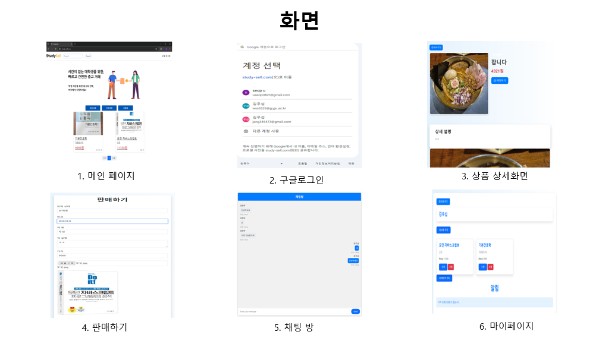
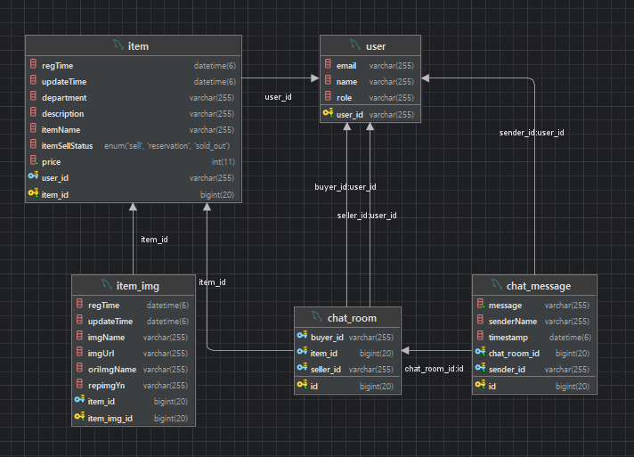

    
   <h2>돈이 부족한 대학생들을 위한 서비스</h2>

---

    

---
#### 2025/01/05 리팩터링 시작
- 엔티티 setter 제거하고 빌더 패턴으로 변경 -> 불변성 유지, 캡슐화 강화, 일관성을 보장
- 테스트 코드 추가
- 예외 처리 추가
- 중복되는 로직 메서드로 추출, 전체적으로 코드 리팩터링
## 프로젝트 정보
- **유형**: 팀 프로젝트 (팀장)
- **기간**: 2024년 4월 ~ 2024년 6월
- **역할**: 팀장으로서 기획, 설계, 개발 및 배포 전반 관리
- **기술 스택**:
    - **백엔드**: Spring Boot, JPA, QueryDSL
    - **프론트엔드**: Thymeleaf, Bootstrap
    - **데이터베이스**: MariaDB (RDS)
    - **클라우드 서비스**: AWS EC2, S3
    - **버전 관리**: Git, GitHub
---

## 프로젝트 개요
- 대학생들이 학기마다 새로 구입해야 하는 교재 비용을 절감할 수 있도록 중고 거래를 통해 경제적 부담을 줄이는 것입니다. 
- 책이 전문적이고, 대중적이지 않은 책이기 때문에 판매하는 사람들이 많이 없어 대학 내에서 직접 거래할 수 있는 플랫폼을 제공하여,
학생들이 안전하고 편리하게 거래할 수 있도록 합니다.
- 가장 큰 이유는 계속 쌓여져 가는 제 전공 책들을 팔고 싶었습니다.
---
## 화면

    

---
## 프로젝트 DB ERD

    

